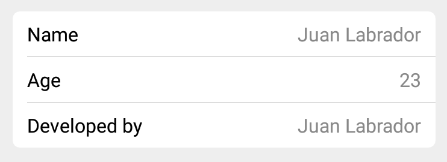
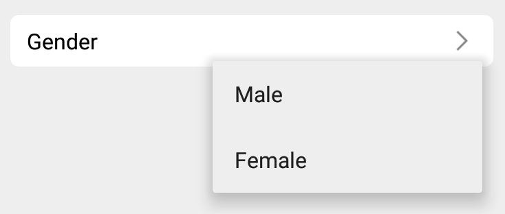

# PanelLayout  [  ](https://bintray.com/juanlabrador/maven/PanelLayout/_latestVersion)
A group of view in container to style iOS 7. For API 21+


Description
-----------

- TextLayout: Consisting of two TextView to display content.
- EditTextLayout: Consisting of one TextView and one EditText.
- MultiTextLayout: Consisting of one TextView to display large text.
- MultiEditTextLayout: Consisting of one EditText to write large text.

How to use
----------

```groovy
compile 'com.github.juanlabrador:panellayout:1.4@aar'
```

In your xml
-----------

```xml
  <com.github.juanlabrador.panellayout.PanelLayout
      android:id="@+id/group"
      android:layout_width="match_parent"
      android:layout_height="wrap_content"/>
```

If you want to customize it, applies these attributes supported:

```xml
  <attr name="backgroundColor" format="color"/>
  <attr name="backgroundBorderColor" format="color"/>
  <attr name="labelTextColor" format="color"/>
  <attr name="contentTextColor" format="color"/>
  <attr name="separatorColor" format="color"/>
  <attr name="textSizeLayout" format="dimension"/>
  <attr name="withBorder" format="boolean"/>
```

Then, you must add this line to apply them

```xml
  xmlns:panel="http://schemas.android.com/apk/res-auto"
```
```xml
  <com.github.juanlabrador.panellayout.PanelLayout
      android:id="@+id/group"
      android:layout_width="match_parent"
      android:layout_height="wrap_content"
      panel:textSizeLayout="16sp"
      panel:withBorder="true"/>
```

By default:

- BorderBackgroundColor is TRANSPARENT
- BackgroundColor is WHITE
- SeparatorColor is LTGRAY
- LabelTextColor is BLACK
- ContentTextColor is GRAY
- TextSizeLayout is 14sp
- WithBorder is true

In your class java
------------------

You declare a PanelLayout object:

```java
  private PanelLayout mPanelLayout;
  ...
  ...
  mPanelLayout = (PanelLayout) findViewById(R.id.group);

```

Add TextLayout
--------------



You can use values String or Text as parameters.

```java
  mPanelLayout.addTextLayout("Name", "Juan Labrador");
  mPanelLayout.addTextLayout(R.string.age, "23");
  mPanelLayout.addTextLayout("Develop by", "Juan Labrador");
```

To edit the label or content, you need to declare a TextLayout object:

```java
  private TextLayout mName;
  ...
  mName = mPanelLayout.addTextLayout("Name", "Juan Labrador");
  ...
  mName.setLabel("Last Name");
  mName.setContent("Labrador");
```

Add EditTextLayout
-----------------


You can use values String or Text as parameters, add too a InputType.

```java
  mPanelLayout.addEditTextLayout("Username");
  mPanelLayout.addEditTextLayout("Password");
```

To edit the label or content, you need to declare a EditTextLayout object:

```java
  EditTextLayout mPassword = mPanelLayout.addEditTextLayout("Password");

  mPassword.isPassword(true);  // Change input type to password

  mPhone.isNumber(true);   // Change input type to number
  mEmail.isEmail(true);   // Change input type to email
```
Add MultiTextLayout
-------------------


```java
  mPanelLayout.addMultiTextLayout(R.string.description);

```

When you do to long press, you copy content to Clipboard.

Add MultiEditTextLayout
-----------------------


- First parameter is for the hint text.
- Second parameter is for the content text.

```java
  mPanelLayout.addMultiEditTextLayout(R.string.description);
```

Add PopupLayout
---------------





You can use values String or Text. Add a menu of res, or String[] or ArrayList<String>. You can use our standards icons or add your icon.

```java
  PopupLayout mPopupLayout = mPanelLayout.addPopupLayout("Gender", R.menu.menu_gender);

  mPopupLayout.getContent();  // Get content selected
  mPopupLayout.getItemPosition();  // Get position item menu
  ...
  ...
  mPanelLayout.addPopupLayout("Country", country);  // With String[]
  mPanelLayout.addPopupLayout("Age", age);  // With ArrayList
  mPanelLayout.addPopupLayout("Gender", R.menu.menu_main, GroupLayout.BLACK);
  mPanelLayout.addPopupLayout("Gender", R.menu.menu_main, R.drawable.youricon);
```

Add ButtonLayout
----------------


You can use values String or Text as parameters, add a text of content and a icon.

```java
  mPanelLayout.addButtonLayout("Phone", "+ 58 424 0000000", R.mipmap.phone);
  ButtonLayout mEmail = mPanelLayout.addButtonLayout("Email", "juanjavierlabrador@gmail.com", R.mipmap.message);
  mEmail.setOnClickListener(new View.OnClickListener() {
      @Override
      public void onClick(View view) {

      }
  });
  ...
  ...
  mEmail.getContent();

```

Log
----
v1.5

- Added ButtonLayout

v1.4

- Added PopupLayout

v1.3

- Added MultiEditTextLayout

v1.2

- Added MultiTextLayout

v1.1.1

- Updated EditTextLayout
    - isNumber(boolean)
    - isEmail(boolean)

v1.1

- Added EditTextLayout
    - isPassword(boolean)

v1.0

- Added TextLayout

Developed by
------------

- Juan Labrador - <juanjavierlabrador@gmail.com>
- Twitter: <a href="https://twitter.com/juanlabrador">@JuanLabrador</a>

Inspiration in
--------------

<a href="https://github.com/vladexologija/GroupedTextView">GroupedTextView</a>